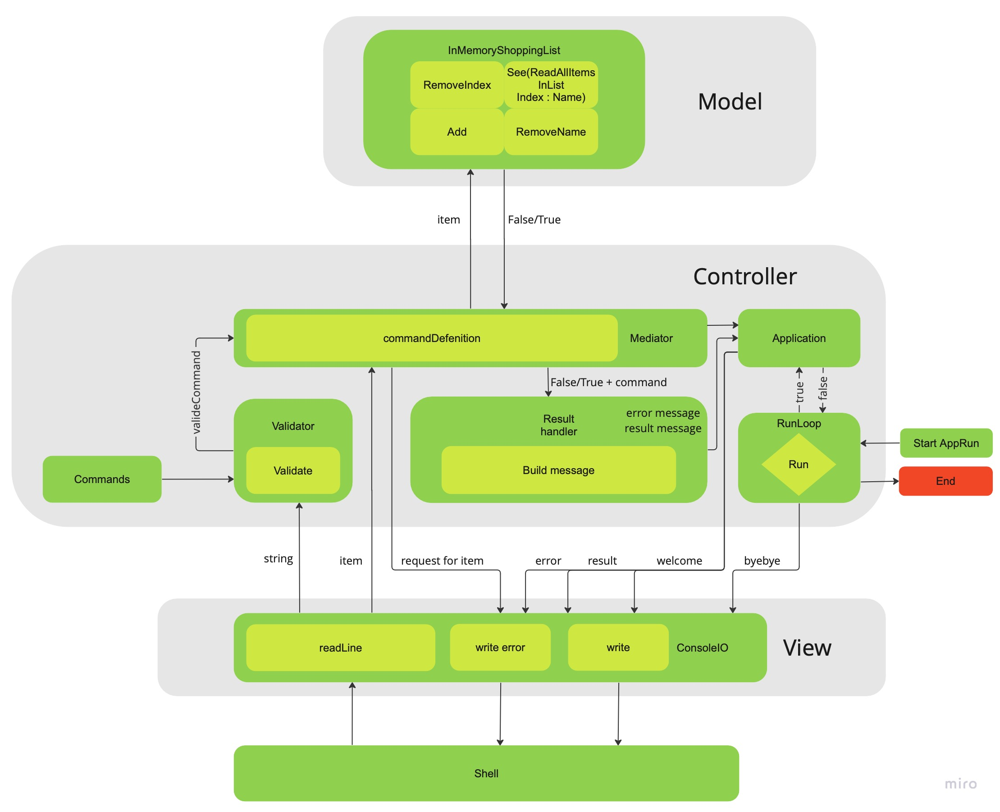

# ShoppingList Application

This is the application for macOS to work in CLI where you can store list of shopping, add and remove items, and view your current shopping list.

[Scheme of application](https://miro.com/app/board/uXjVMd7ba5I=/)

## Usage

The application allows the user to enter commands and execute actions. After launching the app, the user is prompted to input a command, which the app processes and displays the result. The app then prompts the user for the next command and the process repeats until the user decides to exit the application.

## Features

- The max number of items in the list is 10.
- The list cannot contain duplicate items.

## Roadmap

- Add functionality for the next commands help, add, remove, and show items from current shopping list.

- Add tests for non-private methods.

